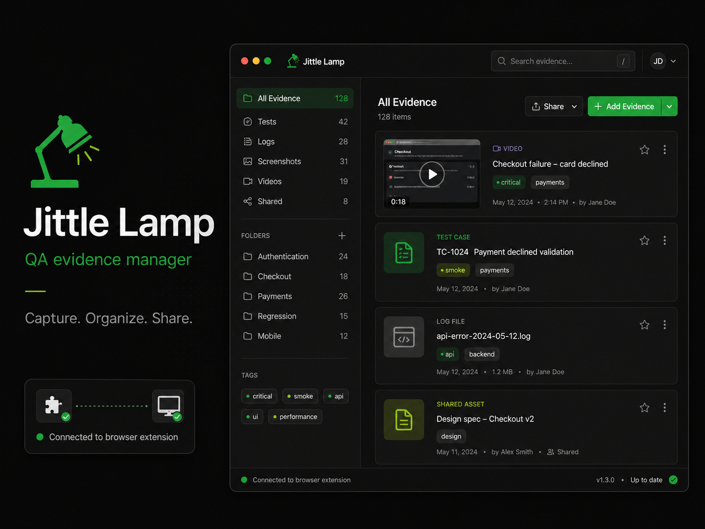

# jittle-lamp

`jittle-lamp` is a QA evidence manager for capturing, organizing, reviewing, and sharing product evidence across browser recordings, screenshots, logs, test cases, and shared review links.



## Install Desktop App

For macOS arm64, install the latest desktop release from Terminal:

```bash
curl -fsSL https://raw.githubusercontent.com/namdien177/jittler-lamp/main/scripts/release/install-macos-desktop.sh | bash
```

To install a specific release:

```bash
curl -fsSL https://raw.githubusercontent.com/namdien177/jittler-lamp/main/scripts/release/install-macos-desktop.sh | JITTLE_LAMP_VERSION=vX.Y.Z bash
```

The same command can also replace an existing install with the latest release. In-app updates use the packaged desktop app's updater instead of a browser download, so they do not use this terminal installer path.

## Workspace layout

- `apps/extension` — Chromium MV3 extension recorder for active-tab capture orchestration.
- `apps/desktop` — Electron desktop companion for capture intake, review, uploads, and app updates.
- `apps/evidence-web` — browser evidence viewer for shared review links and uploaded evidence.
- `apps/backend` — Elysia API for identity, organization context, evidence upload, artifact storage, and share links.
- `packages/shared` — strict TypeScript schemas and helpers shared by the extension and desktop app.
- `docs` — scope, assumptions, and architecture notes for V1.
- `tests` — repository-level smoke tests.

## Product Scope

The current product path centers on a connected evidence workflow:

- strict TypeScript workspace configuration
- Bun workspace scripts for build, typecheck, and test
- MV3 popup/background/content/offscreen runtimes aligned to one active-tab session at a time
- shared event/session/message schemas designed around reviewable `WebM + JSON` evidence artifacts
- sanitized page URLs and interaction metadata without raw typed field values
- richer debugger-backed network events including request/response headers, cookies, bodies, and best-effort omission/truncation metadata
- desktop capture intake, session playback, timeline review, network detail inspection, tag editing, and note saving
- authenticated upload to the backend with organization-aware evidence ownership
- browser-based evidence review through share links
- macOS release packaging with in-app update checks from the Settings screen

See `docs/v1-scope.md` for more detail.

## Commands

```bash
bun install
bun run typecheck
bun run test
bun run build
bun run release:check-version
```

## How to use the software

### 1. Record a session with the extension

1. Run `bun run build` or `bun run --cwd apps/extension build`.
2. Open `chrome://extensions` in Chromium.
3. Turn on **Developer mode**.
4. Click **Load unpacked** and select `apps/extension/dist`.
5. Open an `http://` or `https://` page, open the extension popup, and press **Start**.
6. Interact with the page, then press **Stop**.

The extension captures the session artifacts:

- `recording.webm`
- `session.events.json`

When the desktop companion is running, the extension hands those artifacts to the app for review, organization, upload, and sharing.

### 2. Use the desktop companion and viewer

The desktop app acts as the companion, reviewer, uploader, and release-updated macOS client.

- `bun run --cwd apps/desktop dev` starts the Electron app and local companion server on `http://127.0.0.1:48115`
- `bun run --cwd apps/desktop set-output "/absolute/path"` updates the saved output folder
- `bun run --cwd apps/desktop package:local` builds a local macOS desktop app bundle

Inside the desktop app, the current UI supports:

- **Open Local…** to inspect a session folder
- **Import ZIP…** to open an exported ZIP bundle
- **Choose folder…** / **Open folder** in Settings to manage the companion output route
- **Check for update** in Settings to download and install a newer packaged desktop release
- session playback, timeline review, network detail inspection, tag editing, and note saving
- authenticated evidence upload and share-link review through the backend

### 3. Use the browser evidence viewer

Build the lightweight evidence viewer with:

```bash
bun run --cwd apps/evidence-web build
```

That emits a static viewer into `apps/evidence-web/dist` for browser-based evidence review.

## Release

### Automated release flow

This repo now includes GitHub Actions automation for stable releases.

- pushing a tag that matches `vX.Y.Z`
- on the current `main` branch HEAD
- with all workspace versions already synced to `X.Y.Z`

triggers a release workflow that:

1. runs `bun install`, `bun run release:check-version`, `bun run typecheck`, `bun test`, and `bun run build`
2. packages the Chromium extension into a release ZIP
3. builds a macOS desktop distribution artifact on `macos-14`
4. creates a GitHub Release with GitHub-generated release notes

The release notes/changelog are generated automatically by GitHub when the release is created. There is no manual changelog editing step in the normal tag flow.

### 1. Prepare a release version

Use the root version as the release source of truth. The extension manifest and workspace `package.json` files are checked for sync.

To bump versions before a release:

```bash
bun run release:set-version 0.1.1
bun install
```

Then commit the version bump, merge it to `main`, and create the release tag:

```bash
git tag v0.1.1
git push origin main --tags
```

### 2. Chromium extension release asset

The release workflow builds the extension from `apps/extension/dist` and publishes:

- `jittle-lamp-extension-vX.Y.Z.zip`

This ZIP is for **extract + Load unpacked** usage in Chromium-based browsers. It is not:

- a signed Chrome Web Store package
- a `.crx` package
- a Chrome Web Store publish flow

Local build commands remain:

```bash
bun run build
# or only the extension
bun run --cwd apps/extension build
```

That build generates the unpacked extension directory containing:

- `manifest.json`
- `background.js`
- `content.js`
- `offscreen.js`
- `popup.js`
- `popup.html`
- `popup.css`
- `offscreen.html`

To install the released extension ZIP:

1. Download `jittle-lamp-extension-vX.Y.Z.zip` from the GitHub Release.
2. Extract it.
3. Open `chrome://extensions`.
4. Turn on **Developer mode**.
5. Click **Load unpacked**.
6. Select the extracted folder.

To install from a local build instead:

1. Open `chrome://extensions` or the equivalent extensions page in your Chromium-based browser.
2. Turn on **Developer mode**.
3. Click **Load unpacked**.
4. Select `apps/extension/dist`.

### 3. macOS desktop release asset

The release workflow builds a macOS desktop artifact on a macOS runner and publishes a filename that explicitly states whether it is signed:

- `jittle-lamp-desktop-vX.Y.Z-macos-arm64-signed.dmg`
- or `jittle-lamp-desktop-vX.Y.Z-macos-arm64-unsigned.dmg`

The current workflow always produces an **arm64** macOS artifact. It does not claim Intel/universal support.

#### Unsigned releases

If Apple signing credentials are not configured in GitHub Actions, the workflow still builds an unsigned DMG. CI explicitly applies and verifies an ad-hoc signature so the app bundle is internally consistent, but that is **not** the same thing as Apple Developer ID signing and notarization.

This means a no-cost Apple account is enough for local development, but it is not enough for a frictionless public macOS installer. Public distribution that opens normally on other Macs requires the paid Apple Developer Program so CI can sign with a Developer ID Application certificate and notarize the DMG/app.

Unsigned macOS releases may still be blocked by Gatekeeper after browser download. For internal installs, use the terminal installer so the DMG is downloaded and copied to `/Applications` without browser quarantine metadata:

```bash
curl -fsSL https://raw.githubusercontent.com/namdien177/jittler-lamp/main/scripts/release/install-macos-desktop.sh | bash
```

To install a specific release:

```bash
curl -fsSL https://raw.githubusercontent.com/namdien177/jittler-lamp/main/scripts/release/install-macos-desktop.sh | JITTLE_LAMP_VERSION=vX.Y.Z bash
```

The same terminal installer can be rerun later to replace an existing app with the latest release. The in-app updater downloads update artifacts from inside the packaged desktop app, so it does not go through the browser quarantine path. If an unsigned/ad-hoc update ever fails, rerun the terminal installer to replace the app manually.

If the app was already downloaded through a browser and macOS blocks it, remove quarantine manually after installing the app:

```bash
xattr -cr "/Applications/Jittle Lamp.app"
```

After clearing quarantine, open the app from Finder once. Users may still need to right-click **Open** on the first launch depending on their macOS security settings.

#### Signed and notarized releases

If the required Apple credentials are available in GitHub Actions, the desktop build enables Electron Builder code signing + notarization automatically and the published DMG filename switches to `signed`.

The workflow supports these secrets:

- `MACOS_CSC_LINK` + `MACOS_CSC_KEY_PASSWORD`
- either `APPLE_ID` + `APPLE_APP_SPECIFIC_PASSWORD` + `APPLE_TEAM_ID`
- or `APPLE_API_KEY` + `APPLE_API_KEY_ID` + `APPLE_API_ISSUER`

The API-key path is preferred for CI when App Store Connect API credentials are available.

Desktop packaging is split by environment:

```bash
bun run --cwd apps/desktop package:local
bun run --cwd apps/desktop package:ci
```

Use `package:local` on a developer machine; it loads the workspace `.env` before invoking Electron Builder so local signing/notarization credentials are available. Use `package:ci` in CI/CD; it only uses the environment variables injected by the workflow.

The desktop renderer receives auth/API configuration at build time. Release builds require these GitHub Actions variables or secrets to be available before the tag workflow runs:

- `CLERK_PUBLISHABLE_KEY`
- `JITTLE_LAMP_API_ORIGIN`
- optional: `JITTLE_LAMP_WEB_ORIGIN`

Setting these only in the backend/deployment host is not enough for the macOS desktop artifact, because the packaged app cannot read that server environment after it has been built.

With the checked-in config, Electron Builder writes build output into:

- `apps/desktop/artifacts/`

The release workflow collects the install-oriented artifact from `apps/desktop/artifacts/`.

In-app desktop updates use Electron Builder's GitHub provider. The macOS job publishes the DMG for first install plus the updater ZIP, blockmap, and `latest-mac.yml` metadata that the Settings screen uses when the user clicks **Check for update**. Updates are available only from packaged builds, not from `bun run --cwd apps/desktop dev`.

### 4. Release notes specific to this repo

- The release workflow only accepts stable tags that match `vX.Y.Z`.
- The tag must point at the current `main` HEAD.
- `bun run release:check-version` fails if any workspace package version drifts from the root release version.
- The extension companion integration assumes the desktop companion intake server runs on `http://127.0.0.1:48115`.
- The desktop companion output folder can be changed through the desktop UI or the CLI helper:

```bash
bun run --cwd apps/desktop set-output "/absolute/path"
```

For the desktop app specifically:

- `bun run --cwd apps/desktop dev` builds and starts the Electron desktop app with the companion intake server on `http://127.0.0.1:48115`.
- `bun run --cwd apps/desktop set-output "/absolute/path"` changes the folder where the companion writes sessions.
- `bun run --cwd apps/desktop package:local` attempts a local Electron Builder package build with workspace `.env` loaded.
- `bun run --cwd apps/desktop package:ci` attempts a CI Electron Builder package build using only environment-provided secrets.
- `bun run --cwd apps/desktop build` performs the repository's lightweight desktop shell build validation used by the workspace root.

The companion only accepts artifact writes from `chrome-extension://` origins and rejects normal web origins. It does not currently pin a single extension ID. Output-folder changes happen through the desktop app or CLI, not over HTTP.

## Extension workflow

1. Run `bun run build` or `bun run --cwd apps/extension build`.
2. Optional but recommended: run `bun run --cwd apps/desktop set-output "/absolute/path"` once.
3. Start the desktop companion with `bun run --cwd apps/desktop dev` so captured artifacts are handed to the app.
4. Load `apps/extension/dist` as an unpacked extension in Chromium.
5. Open an `http://` or `https://` tab and open the extension popup.
6. Press **Start** and grant site access when prompted so capture can survive normal navigations.
7. Interact with the page, then press **Stop**.
8. If the companion server is running, artifacts are handed to the desktop app. Otherwise Chromium prompts you to save the session artifacts:
   - `recording.webm`
   - `session.events.json`

### Recorder architecture

- **popup**: start/stop/status UI
- **background**: canonical session controller, storage checkpointing, and debugger bridge
- **offscreen document**: `MediaRecorder`, chunk aggregation, and fallback browser download export
- **desktop companion server**: localhost intake route used by the extension to hand artifacts to the app
- **content script**: content-ready + interaction capture (`click`, `input`, `submit`, `navigation`)

The exported JSON is the shared `SessionBundle` object rather than a bare event array. The recorder intentionally avoids raw typed field values, strips query/hash fragments from captured page URLs, preserves network request URLs as captured by the browser, and keeps captured network credentials/cookies available for authorized evidence review.

### Expanded network capture

When the Chrome debugger is attached, the recorder now exports richer per-request network events built from the existing CDP path:

- request headers and associated cookies
- request post data / body when CDP exposes it
- response headers plus parsed `set-cookie` headers/cookies
- response bodies captured after `Network.loadingFinished`
- omission/truncation metadata when bodies are unavailable or too large to store in-session

The popup still shows session status locally, but it now receives a typed active-session summary instead of the full live event draft so larger sessions do not obviously break the popup path.
